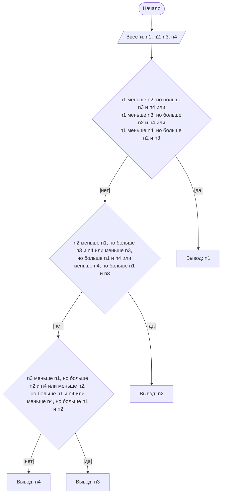

## Отчет по лабораторной работе № 1

#### № группы: `ПМ-2401`

#### Выполнил: `Самойленко Роман Алексеевич`

#### Вариант: `24`

### Cодержание:

- [Постановка задачи](#1-постановка-задачи)
- [Входные и выходные данные](#2-входные-и-выходные-данные)
- [Выбор структуры данных](#3-выбор-структуры-данных)
- [Алгоритм](#4-алгоритм)
- [Программа](#5-программа)
- [Анализ правильности решения](#6-анализ-правильности-решения)

### 1. Постановка задачи

- Условия задачи

> На вход программы подается четыре различных целых числа. Вывести на
экран число, которое меньше одного и больше двух других чисел (то есть,
это число в отсортированной последовательности стояло бы третьим).


- Требуется получить на вход четыре числа и вывести число, которое стояло бы третьим в отсортированном списке из полученных чисел

  ### 2. Входные и выходные данные

Входные данные:
- четыре целых числа
- диапазон значений не задан

Выходные данные:
- одно целое число
- диапазон значений не задан

### 3. Выбор структуры данных

Целое число, у которого не задана верхняя граница. Лучше всего подходит long, т.к. этот тип данных имеет самый большой диапазон значений.

### 4. Алгоритм

1. Запись четырёх чисел в переменные n1, n2, n3, n4.
2. Проверяю каждый элемент на условие.
3. При нахожднии ответа печатаю его.



### 5. Программа

```java
import java.util.Scanner;
import java.io.PrintStream;

public class Main {
    public static Scanner in = new Scanner(System.in);
    public static PrintStream out = System.out;

    public static void main(String[] args)
    {
        long n1 = in.nextLong();
        long n2 = in.nextLong();
        long n3 = in.nextLong();
        long n4 = in.nextLong();

        /*
            Всего три возможных случая для подходящего n,
            потому что подходящий n должен быть меньше только одного из трёх оставшихся n.
            Между этими слуаями нужно поставить ||(или).
        */
        if ((n1 > n2 && n1 > n3 && n1 < n4) || (n1 > n4 && n1 > n3 && n1 < n2) || (n1 > n4 && n1 > n2 && n1 < n3)) {
            out.println(n1);
        } else if ((n2 > n1 && n2 > n3 && n2 < n4) || (n2 > n4 && n2 > n3 && n2 < n1) || (n2 > n4 && n2 > n1 && n2 < n3)) {
            out.println(n2);
        } else if ((n3 < n1 && n3 > n2 && n3 > n4) || (n3 < n4 && n3 > n2 && n3 > n1) || (n3 < n2 && n3 > n1 && n3 > n4)) {
            out.println(n3);
        } else{
            out.println(n4);
        }
    }
}
```

### 6. Анализ правильности решения

1. Тест

- Input:
    ```
    3
    2
    1
    4
    ```

- Output:
    ```
    3
    ```

2. Тест

- Input:
    ```
    1
    3
    2
    4
    ```

- Output:
    ```
    3
    ```

3. Тест

- Input:
    ```
    1
    2
    3
    4
    ```

- Output:
    ```
    3
    ```
4. Тест

- Input:
    ```
    1
    2
    4
    3
    ```

- Output:
    ```
    3
    ```
