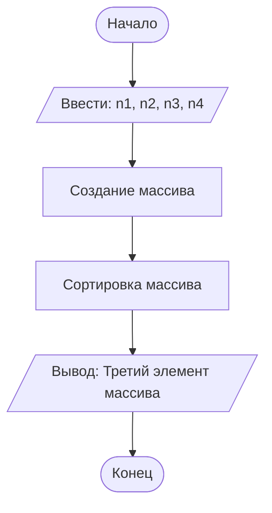

## Отчет по лабораторной работе № 1

#### № группы: `ПМ-2401`

#### Выполнил: `Самойленко Роман Алексеевич`

#### Вариант: `24`

### Cодержание:

- [Постановка задачи](#1-постановка-задачи)
- [Входные и выходные данные](#2-входные-и-выходные-данные)
- [Выбор структуры данных](#3-выбор-структуры-данных)
- [Алгоритм](#4-алгоритм)
- [Программа](#5-программа)
- [Анализ правильности решения](#6-анализ-правильности-решения)

### 1. Постановка задачи

- Условия задачи

> На вход программы подается четыре различных целых числа. Вывести на
экран число, которое меньше одного и больше двух других чисел (то есть,
это число в отсортированной последовательности стояло бы третьим).


- Требуется получить на вход четыре числа и вывести число, которое стояло бы третьим в отсортированном списке из полученных чисел

  ### 2. Входные и выходные данные

Входные данные:
- четыре целых числа;
- диапазон значений не задан;

Выходные данные:
- одно целое число;
- диапазон значений не задан;

### 3. Выбор структуры данных

Целое число, у которого не задана верхняя граница. Лучше всего подходит Long.

### 4. Алгоритм

1. Запись четырёх чисел в переменные n1, n2, n3, n4.
2. Создание массива из этих чисел.
3. Сортировка массива.
4. Вывод на экран третьего элемента массива (с индексом 2).

В 1 лабораторной работе блок-схем обязательна. Ниже представлен пример с лекции,
реализованный с помощью `mermaid` - инструментом для рисования диаграмм и блок-схем.



### 5. Программа

```java
import java.util.Scanner;
import java.io.PrintStream;
import java.util.Arrays;

public class Main {
    public static Scanner in = new Scanner(System.in);
    public static PrintStream out = System.out;
    public static void main(String[] args) {

        long n1 = in.nextLong();
        long n2 = in.nextLong();
        long n3 = in.nextLong();
        long n4 = in.nextLong();

        Long[] m = {n1, n2, n3, n4};
        Arrays.sort(m);

        out.print(m[2]);
    }
}
```

### 6. Анализ правильности решения

1. Тест

- Input:
    ```
    1
    1
    1
    3
    ```

- Output:
    ```
    1
    ```

2. Тест

- Input:
    ```
    1
    0
    0
    -1
    ```

- Output:
    ```
    0
    ```
3. Тест

- Input:
    ```
    1
    2
    3
    4
    ```

- Output:
    ```
    3
    ```
